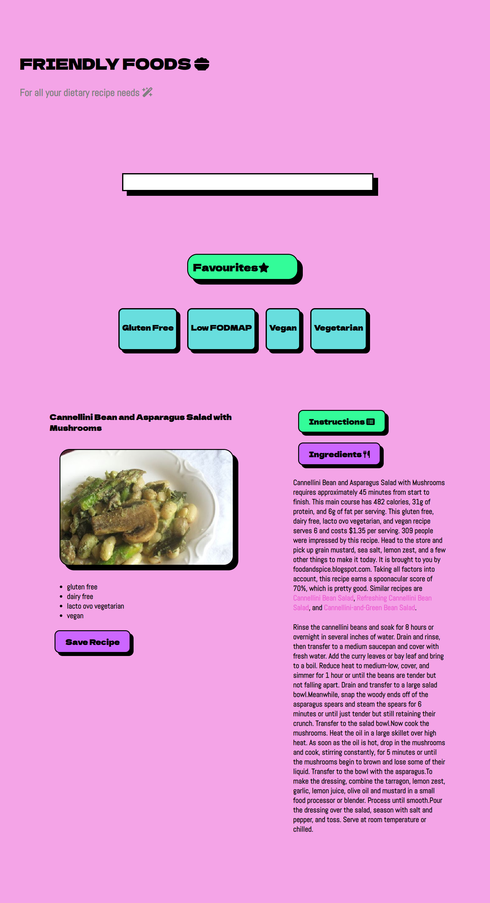

# Friendly Foods Recipe App

## Description

The creation of this project was motivated by the lack of easily accessible foods and recipies for people who have specific dietary requirements. We figured that it would be fantastic if there was a resource that people could use to easily and quickly look up lists of recipes that fit their own personal dietary requirements but also to be able to search for a certain food or recipe and see if they can find something that suits their needs, both dietary and in terms of their preferences.

This app solves the problem of people with dietary requirements struggling to quickly and easily find delicious recipes that fit their needs, and the app can potentially be expanded to include more types of recipes and more dietary requirement filters in the future should there be the demand for it.

In creating this project, we learnt a lot about using create-react-app, and combining this with using APIs, saving to local storage and also utilising libraries, packages and components within a react application. For example, we used Styled Components and React Router in order to apply styles with CSS syntax within Javascript and apply this to our react components, and to enable client side routing respectively. We greatly improved our skills working with react, javascript, APIs and HTML and CSS as well as our collaborative skills using GitHub.

## Installation

No installation required, however in order to run the app directly from the repo files you will need to open the terminal and npm start.

## Usage

### Deployed Application

In order to access the deployed application you will need to visit the following link:

### GitHub Repository

To visit the github repository, go to the following link:
https://github.com/itsHazzic/recipe-app

### How to use the application

When you open the application you will be brought to the home screen, as shown:

In order to use the search function of the app, you need to click on the search bar and type the name of the food or recipe you want to find, and the relevant recipes will be displayed after you hit enter.

In order to filter the recipes and find recipes for a specific dietary requirement, click on one of the buttons such as "Gluten Free" and the app will show recipes that fit that particular dietary requirement.

You can then click on whichever recipe you are interested in and the app will show you the detailed recipe page with the instructions on how you create this recipe.

If you click the "ingredients" button, the app will display the ingredients that you need to make this particular recipe. The button which is active will be coloured green so you know which page you are viewing.

When you are viewing a recipe, if you click "save recipe" this will save the recipe to your favourites, which can then be viewed by clicking on "favourites" where you will be able to see the recipe that you saved as a favourite.

## Credits

### Collaborators

The collaborators who worked on this project were:

Sarah Marr https://github.com/itsHazzic
Charlotte Vaughan https://github.com/PsychicSalad

### APIs used

https://spoonacular.com/food-api

### Tutorials used

Adding FontAwesome icons in react:
https://www.youtube.com/watch?v=7fdpzXeXbcE&ab_channel=AbhiRaj

React Styled Components:
https://www.youtube.com/watch?v=7BHsAcAvTQ0&t=344s&ab_channel=SteveGriffith-Prof3ssorSt3v3

APIs and react:
https://www.youtube.com/watch?v=je3FTTunyp4&ab_channel=PedroTech

## License

This project uses React which uses an MIT License as it is an open source software. Please visit the React license itself to find out more.
